<div align="center">


# Premier Laundry

**Aplikasi laundry jemput-antar dengan 3 role dalam satu aplikasi: Customer, Kurir, dan Admin.**

Pesan laundry kiloan atau satuan dari HP, pantau status secara real-time, bayar lewat QRIS atau Xendit, dan kumpulkan poin loyalty untuk cuci gratis.


</div>

---

## Daftar Isi

- [Tentang Proyek](#tentang-proyek)
- [Screenshot](#screenshot)
- [Fitur](#fitur)
- [Alur Pesanan](#alur-pesanan)
- [Aturan Bisnis](#aturan-bisnis)
- [Arsitektur & Tech Stack](#arsitektur--tech-stack)
- [Struktur Proyek](#struktur-proyek)
- [Database](#database)
- [Edge Functions](#edge-functions)
- [Cara Menjalankan](#cara-menjalankan)
- [Dokumentasi Lengkap](#dokumentasi-lengkap)
- [Branding](#branding)

---

## Tentang Proyek

Premier Laundry membantu usaha laundry menggantikan pencatatan manual dan chat WhatsApp dengan satu aplikasi yang menghubungkan tiga pihak:

| Role | Peran |
| --- | --- |
| **Customer** | Membuat pesanan, memilih alamat di peta, membayar, dan memantau status laundry. |
| **Kurir** | Menerima tugas jemput/antar, membuka rute di Maps, dan memperbarui status perjalanan. |
| **Admin** | Mengelola pesanan, menimbang laundry kiloan, memverifikasi pembayaran, menugaskan kurir, dan melihat laporan. |

Setelah login, aplikasi membaca role dari tabel `profiles` lalu mengarahkan pengguna ke dashboard yang sesuai. Keamanan data dijaga dengan **Row Level Security (RLS)** di Supabase, bukan hanya pemisahan tampilan di Flutter.

---

## Screenshot

Diambil langsung dari aplikasi yang berjalan di emulator Android (tampilan Customer).

<table>
  <tr>
    <td align="center">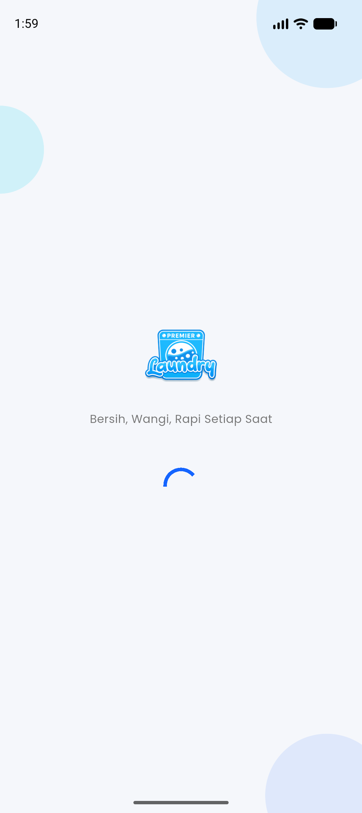<br /><sub><b>Splash</b></sub></td>
    <td align="center">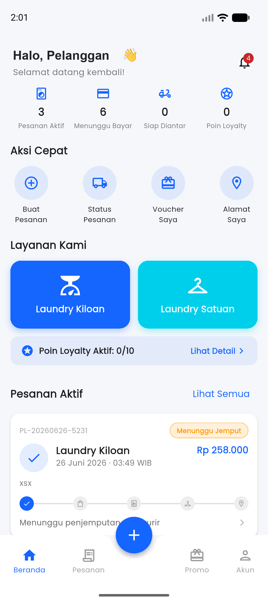<br /><sub><b>Beranda</b></sub></td>
    <td align="center">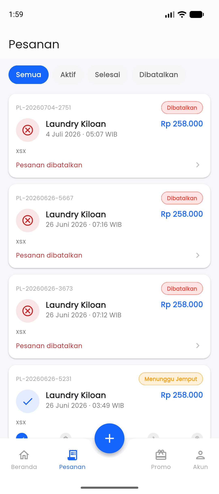<br /><sub><b>Daftar Pesanan</b></sub></td>
    <td align="center">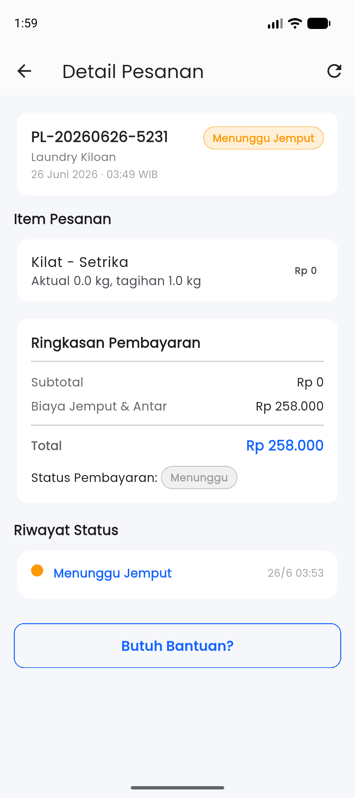<br /><sub><b>Detail Pesanan</b></sub></td>
  </tr>
  <tr>
    <td align="center">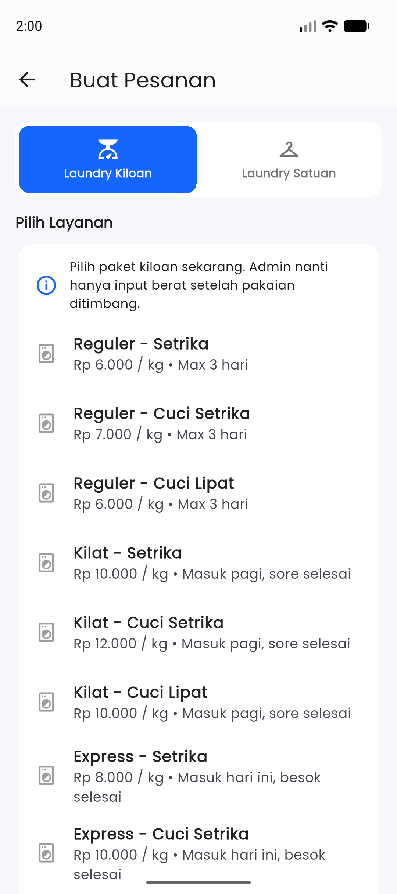<br /><sub><b>Buat Pesanan: Kiloan</b></sub></td>
    <td align="center">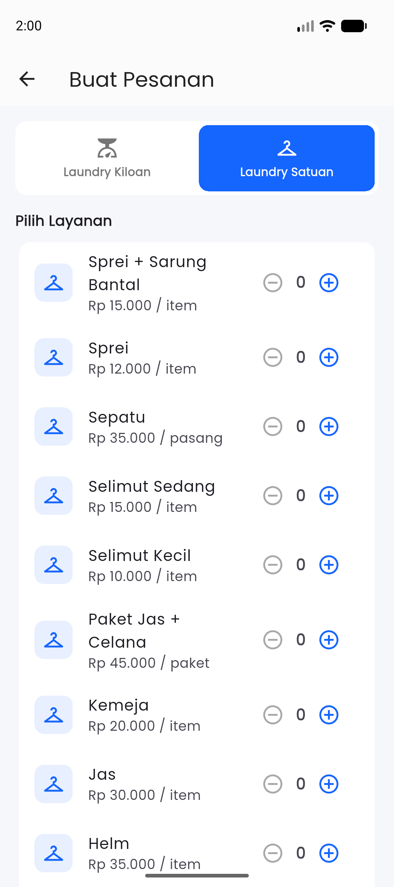<br /><sub><b>Buat Pesanan: Satuan</b></sub></td>
    <td align="center">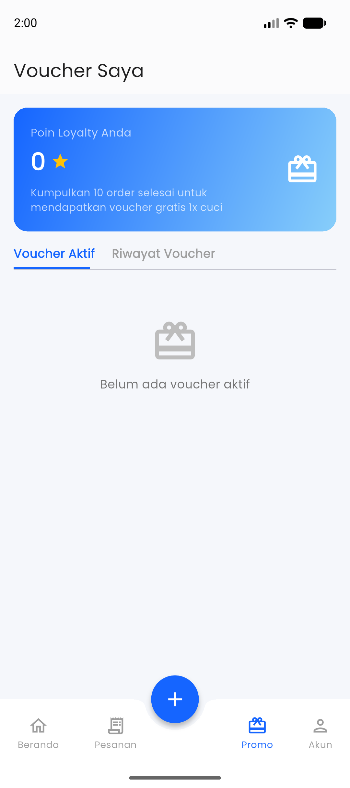<br /><sub><b>Voucher & Loyalty</b></sub></td>
    <td align="center">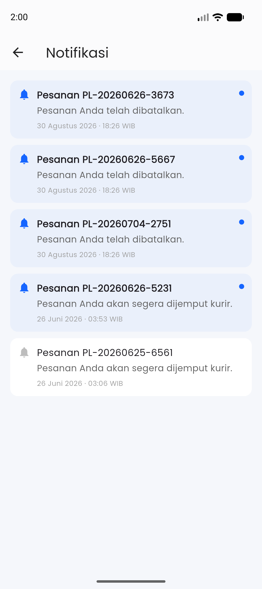<br /><sub><b>Notifikasi</b></sub></td>
  </tr>
</table>

---

## Fitur

### Customer

- Register, login, lupa dan reset password (deep link `premierlaundry://reset-password`)
- Kelola profil, foto profil, dan ubah password
- Kelola alamat dengan **pemilih titik lokasi di peta OpenStreetMap** (pencarian, lokasi saat ini, atau tap pada peta)
- Buat pesanan **Laundry Kiloan** (Reguler / Kilat / Express × Cuci Setrika / Cuci Lipat / Setrika) dan **Laundry Satuan** (sprei, selimut, jas, kemeja, sepatu, helm, dan lainnya)
- Estimasi **biaya jemput & antar** otomatis berdasarkan jarak
- Pembayaran **QRIS manual + upload bukti** atau **Xendit** (transfer bank, e-wallet, kartu)
- Lacak status pesanan lengkap dengan timeline dan riwayat status
- Poin loyalty dan voucher gratis cuci
- Notifikasi push (FCM) dan notifikasi dalam aplikasi
- Bantuan & FAQ, hubungi admin lewat WhatsApp

### Kurir

- Dashboard ringkasan tugas hari ini
- Daftar tugas jemput dan antar, riwayat tugas
- Detail alamat customer dan **buka rute di aplikasi Maps**
- Update status tugas: menuju lokasi → pakaian diambil → menuju lokasi antar → selesai
- Customer otomatis mendapat notifikasi di tiap perubahan status

### Admin

- Dashboard ringkasan pesanan dan pembayaran
- Daftar dan detail semua pesanan, ubah status laundry
- **Input berat aktual** laundry kiloan dan generate tagihan
- **Verifikasi bukti pembayaran** QRIS (Valid / Tolak)
- Assign kurir, tambah akun kurir, pantau ketersediaan kurir
- Kelola layanan dan harga (kiloan & satuan)
- Atur tarif biaya jemput & antar per rentang jarak
- Kelola voucher
- **Laporan pendapatan** (hari ini, 1 minggu, 1 bulan) dan ekspor **PDF**
- Pengaturan toko: lokasi toko dan gambar QRIS
- Data pesanan dan pembayaran diperbarui **real-time** lewat Supabase Realtime

---

## Alur Pesanan

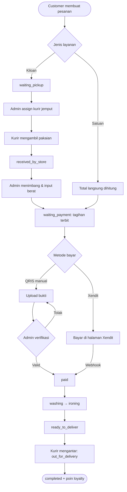

Status pesanan yang dipakai aplikasi: `created`, `waiting_pickup`, `picked_up`, `received_by_store`, `waiting_weight_input`, `waiting_payment`, `paid`, `washing`, `ironing`, `ready_to_deliver`, `out_for_delivery`, `completed`, `cancelled`.

---

## Aturan Bisnis

### Total pesanan

```text
total = subtotal laundry + biaya jemput & antar − diskon
```

### Biaya jemput & antar

Jarak dihitung dari koordinat toko ke alamat customer dengan rumus **Haversine** (estimasi garis lurus). Karena layanan mencakup dua perjalanan, ongkos dikali 2:

```text
biaya jemput & antar = ceil(jarak_km) × tarif_per_km × 2
```

| Rentang Jarak | Tarif per Km |
| --- | ---: |
| 0 – 2 km | Rp5.000 |
| 2 – 5 km | Rp4.000 |
| 5 – 8 km | Rp3.500 |
| > 8 km | Rp3.000 |

Contoh: jarak 5,2 km → `6 × 3.500 × 2` = **Rp42.000**. Tarif bisa diubah admin dari aplikasi.

### Berat laundry kiloan

Berat aktual hasil timbang disimpan apa adanya, sedangkan **berat tagihan dibulatkan ke atas per 0,5 kg, minimum 1 kg**.

| Berat Aktual | Berat Tagihan |
| ---: | ---: |
| 0,7 kg | 1,0 kg |
| 1,1 kg | 1,5 kg |
| 1,6 kg | 2,0 kg |
| 2,0 kg | 2,0 kg |

### Loyalty

- Setiap pesanan yang selesai menambah **1 poin**.
- Setiap **10 poin** menghasilkan voucher **gratis 1× cuci** (diskon 100% untuk layanan).
- Biaya jemput & antar tetap dibayar customer.

### Pembatalan

Customer dapat membatalkan pesanan selama status masih `created` dan belum dibayar. Setelah itu pembatalan lewat admin.

---

## Arsitektur & Tech Stack

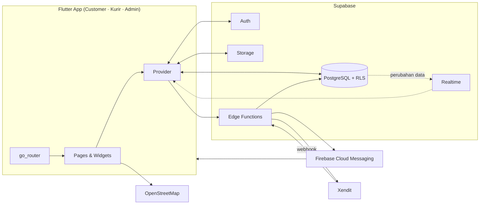

| Layer | Teknologi |
| --- | --- |
| Mobile | Flutter, Material 3, Google Fonts (Poppins) |
| State management | `provider` |
| Navigasi | `go_router` (dengan redirect auth dan deep link) |
| Backend | Supabase: PostgreSQL, Auth, Storage, Realtime, Edge Functions (Deno/TypeScript) |
| Peta & lokasi | `flutter_map` + OpenStreetMap, `geolocator`, `latlong2` |
| Notifikasi | Firebase Cloud Messaging, `flutter_local_notifications` |
| Pembayaran | QRIS statis + upload bukti, Xendit (Test Mode) |
| Laporan | `pdf` + `printing` |
| Lainnya | `image_picker`, `cached_network_image`, `url_launcher`, `intl`, `uuid` |

---

## Struktur Proyek

```text
premire_laundry/
├── lib/
│   ├── main.dart                 # Entry point, theme, MultiProvider
│   ├── router/app_router.dart    # Semua route + redirect auth + deep link
│   ├── core/
│   │   ├── constants/            # Warna brand, kunci Supabase (lokal)
│   │   ├── services/             # Notification service (FCM)
│   │   └── utils/                # Format mata uang/tanggal, PDF laporan, WhatsApp
│   ├── models/                   # Order, Payment, Address, Voucher, dst.
│   ├── providers/                # Auth, Customer, Courier, Admin, Notification
│   ├── pages/
│   │   ├── auth/                 # Splash, login, register, lupa/reset password
│   │   ├── customer/             # Beranda, pesanan, alamat, pembayaran, voucher, profil
│   │   ├── courier/              # Dashboard, tugas, riwayat, akun
│   │   ├── admin/                # Dashboard, pesanan, kurir, pembayaran, laporan, layanan, ongkir, voucher, pengaturan
│   │   └── shared/               # Notifikasi
│   └── widgets/                  # Komponen reusable (kartu pesanan, timeline, badge status, dll.)
├── supabase/
│   ├── functions/                # Edge Functions + .env.example
│   ├── config.toml
│   └── deploy.sh                 # Script deploy semua function
├── docs/                         # Dokumentasi, SQL setup/migrasi, diagram draw.io
├── assets/branding/              # Logo, ikon aplikasi, splash
└── test/
```

---

## Database

Skema ada di [`docs/setup.sql`](docs/setup.sql) dan migrasi lanjutan di `docs/*.sql`. Seluruh tabel dilindungi RLS ([`docs/RLS.md`](docs/RLS.md)).

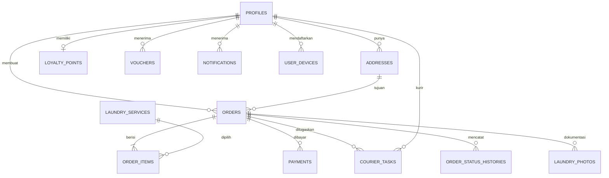

| Tabel | Fungsi |
| --- | --- |
| `profiles` | Data pengguna dan `role` (`customer` / `courier` / `admin`), ketersediaan kurir |
| `addresses` | Alamat customer beserta koordinat |
| `laundry_services` | Katalog layanan dan harga (kiloan & satuan) |
| `orders`, `order_items` | Pesanan, item, subtotal, ongkir, diskon, total |
| `payments` | Pembayaran manual maupun Xendit beserta status |
| `courier_tasks` | Tugas jemput/antar per kurir |
| `order_status_histories` | Riwayat perubahan status (tampil sebagai timeline) |
| `delivery_fees` | Tarif per km berdasarkan rentang jarak |
| `loyalty_points`, `vouchers` | Poin loyalty dan voucher |
| `notifications`, `user_devices` | Notifikasi dalam aplikasi dan token FCM |
| `settings` | Lokasi toko dan gambar QRIS |
| `order_code_sequences` | Penomor urut kode pesanan per hari (`PL-YYYYMMDD-001`) |

Diagram lengkap tersedia dalam format draw.io: [`docs/erd.drawio`](docs/erd.drawio) dan [`docs/class_diagram.drawio`](docs/class_diagram.drawio).

---

## Edge Functions

Rahasia (kunci Xendit, service account Firebase) **tidak pernah disimpan di aplikasi Flutter**. Semuanya ada di Supabase Edge Function secrets.

| Function | Fungsi |
| --- | --- |
| `send-notification` | Mengirim push notification ke perangkat user lewat Firebase Admin SDK |
| `create-xendit-invoice` | Membuat invoice di Xendit dan mengembalikan `invoice_url` ke aplikasi |
| `xendit-webhook` | Menerima callback Xendit, lalu memperbarui `payments` dan `orders` menjadi `paid` |
| `complete-order-generate-loyalty` | Menyelesaikan pesanan, menambah poin loyalty, dan membuat voucher tiap 10 pesanan |

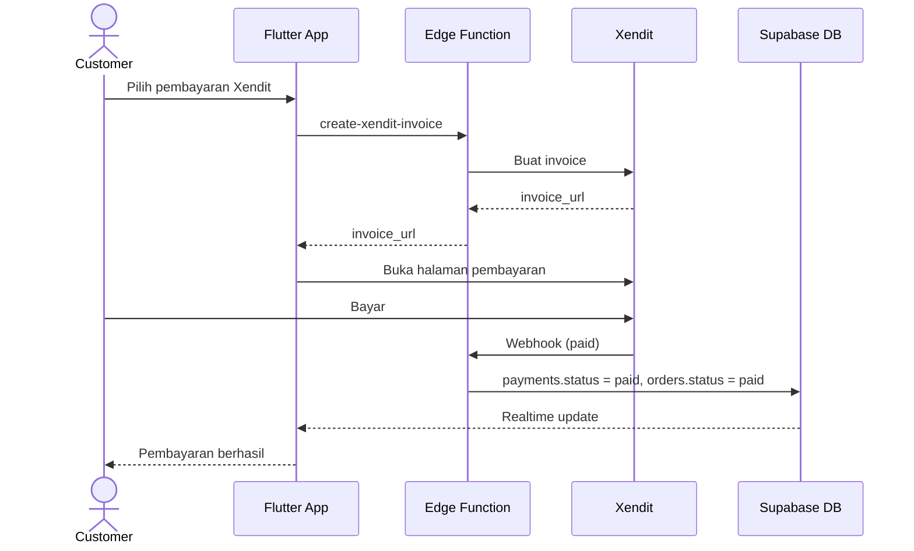

Panduan uji pembayaran (kartu dan nomor e-wallet test) ada di [`docs/TesPayment.md`](docs/TesPayment.md).

---

## Cara Menjalankan

### Prasyarat

- Flutter SDK (stable) dengan Dart `^3.12`
- Akun [Supabase](https://supabase.com) dan Supabase CLI
- Proyek [Firebase](https://console.firebase.google.com) untuk FCM
- Akun [Xendit](https://xendit.co) (Test Mode) jika ingin mencoba payment gateway

### 1. Clone dan install dependency

```bash
git clone https://github.com/Mifta24/premire_laundry.git
cd premire_laundry
flutter pub get
```

### 2. Siapkan database Supabase

1. Buat proyek baru di Supabase.
2. Buka **SQL Editor**, jalankan [`docs/setup.sql`](docs/setup.sql), lalu migrasi tambahan di folder `docs/` sesuai kebutuhan.
3. Terapkan policy RLS dari [`docs/RLS.md`](docs/RLS.md).

### 3. Isi kunci Supabase

Buat file `lib/core/constants/supabase_keys.dart` (sudah masuk `.gitignore`, jadi tidak ikut ter-commit):

```dart
class SupabaseKeys {
  static const String supabaseUrl = 'https://<PROJECT_REF>.supabase.co';
  static const String supabaseAnonKey = '<SUPABASE_ANON_KEY>';
}
```

Nilai ini ada di **Supabase → Project Settings → API**.

### 4. Konfigurasi Firebase

Tambahkan konfigurasi Firebase untuk platform yang dipakai:

- Android: `android/app/google-services.json`
- iOS: `ios/Runner/GoogleService-Info.plist`
- Atur ulang `lib/firebase_options.dart` dengan `flutterfire configure`

### 5. Deploy Edge Functions

Salin [`supabase/functions/.env.example`](supabase/functions/.env.example) sebagai acuan secrets, lalu jalankan:

```bash
bash supabase/deploy.sh
```

Script ini login ke Supabase CLI, mengatur secrets (`FIREBASE_SERVICE_ACCOUNT`, `XENDIT_SECRET_KEY`, `XENDIT_WEBHOOK_TOKEN`), dan mendeploy keempat function. Setelah itu daftarkan URL `xendit-webhook` di **Xendit Dashboard → Settings → Webhooks**.

### 6. Jalankan aplikasi

```bash
flutter run
```

### Membuat akun admin dan kurir

Pendaftaran lewat aplikasi selalu menghasilkan role `customer`. Untuk membuat admin, ubah kolom `role` pada baris pengguna di tabel `profiles` menjadi `admin`. Akun kurir ditambahkan oleh admin lewat tombol **tambah kurir** (ikon orang dengan tanda +) di tab **Kurir**.

### Perintah berguna

```bash
flutter analyze                       # analisis statis
flutter test                          # jalankan test
dart run flutter_launcher_icons       # regenerasi ikon aplikasi
dart run flutter_native_splash:create # regenerasi splash screen
```

---

## Dokumentasi Lengkap

| Dokumen | Isi |
| --- | --- |
| [`docs/README.md`](docs/README.md) | Ringkasan stack dan catatan MVP |
| [`docs/AGENTS.md`](docs/AGENTS.md) | Pembagian role dan hak akses |
| [`docs/ALUR.md`](docs/ALUR.md) | Alur lengkap dari order sampai selesai |
| [`docs/DATABASE.md`](docs/DATABASE.md) | Rancangan database dan ERD |
| [`docs/RLS.md`](docs/RLS.md) | Kebijakan Row Level Security |
| [`docs/ONGKIR.md`](docs/ONGKIR.md) | Aturan biaya jemput & antar dan pembulatan berat |
| [`docs/TesPayment.md`](docs/TesPayment.md) | Cara menguji pembayaran Xendit |
| `docs/sequence_*.drawio` | Sequence diagram: login, buat pesanan, pembayaran, proses pesanan, kurir, admin |

---

## Branding

| Elemen | Nilai |
| --- | --- |
| Primary | `#1565FF` |
| Secondary | `#00CFEB` |
| Light Blue | `#87CEFA` |
| Accent Purple | `#7B61FF` |
| Background | `#F5F7FB` |
| Font | Poppins |
| Tagline | *Bersih, Wangi, Rapi Setiap Saat* |

Aset logo, ikon, dan splash ada di [`assets/branding/`](assets/branding/).

---

<div align="center">

Dibuat dengan Flutter dan Supabase untuk Premier Laundry.

</div>
